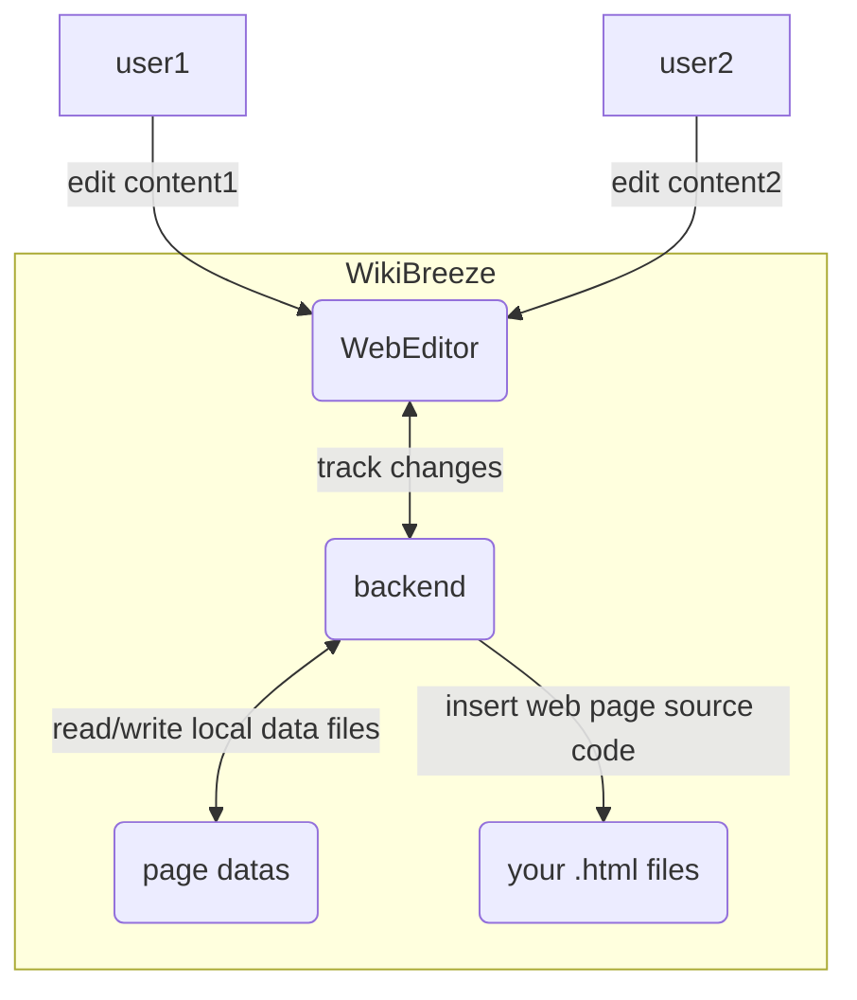

# WikiBreeze ([简体中文](https://github.com/950288/WikiBreeze/blob/main/README_zh.md)) 🛠️

[](mailto:950288s@gmail.com)

WikiBreeze es un editor de contenido colaborativo para wikis en LAN que permite la separación completa entre la escritura de código de la wiki🧑‍💻 y el llenado de contenido ✍️ con una operatividad concisa 🦾, lo que puede mejorar considerablemente la eficiencia del desarrollo de la wiki 🥰.

Aquí hay unos tutoriales para que los iGEMers comiencen: [Intuitive illustrated Wikibreeze tutorials for iGEMers](https://github.com/950288/WikiBreeze/wiki/Intuitive-illustrated-Wikibreeze-tutorials-for-iGEMers)

## Introducción🧑‍💼

WikiBreeze es un editor de LAN intuitivo 🧰 que permite a los miembros del equipo de iGEM editar wikis fácilmente. Proporciona una interfaz sencilla para editar las páginas de contenido de la wiki. Y solo una persona de todo el equipo necesita instalarlo para habilitar la edición colaborativa para todo el grupo. Con WikiBreeze, los editores de contenido de la wiki pueden centrarse en la calidad del contenido sin tener que pensar en los detalles técnicos de HTML y CSS.

Para usar WikiBreeze, siga estos pasos:

1. Descargue el último [release](https://github.com/950288/WikiBreeze/releases) del archivo zip y descomprímalo. Coloque la carpeta `WikiBreeze` en el directorio raíz de su proyecto de wiki.  
````
    <nombre del directorio>
    ├── Wikibreeze
    │   ├── WikiBreeze.exe
    │   └── ...
    ├── xxx.html
    └── ...
````

2. Inserte la siguiente etiqueta especial en cada archivo `.html` u otro tipo de archivo que desee editar: `<!-- WikiBreeze {{CONTENT}} start-->`. Reemplace `{{CONTENT}}` con un nombre personalizado arbitrario. (Nota: Una página puede contener múltiples etiquetas con nombres diferentes, y cada parte correspondiente a una etiqueta puede editarse independientemente). Si no se encuentra ningún archivo que contenga esta etiqueta en el directorio del proyecto, se generará automáticamente un archivo de muestra `testPage.html`.
```html
<div> 
    <!-- WikiBreeze test1 start-->
</div>
```

3. Use una terminal para ejecutar el archivo ejecutable WikiBreeze.exe en el directorio WikiBreeze para iniciar la herramienta. Luego verá la URL generada en la consola, como se muestra a continuación. Puede editar su wiki en el navegador a través de la URL generada. WikiBreeze también admite la edición colaborativa dentro de una LAN (por ejemplo, punto de acceso personal, red universitaria, etc.), por lo que los miembros del equipo dentro de la misma LAN pueden acceder a la página de edición a través del segundo enlace.
```
Server started on port 5001
    Local:           http://localhost:5001
    Network:         http://192.168.Xx.xx:5001
```  

4. El código fuente HTML después de editar y guardar se insertará automáticamente en la posición relativa de la página. Al mismo tiempo, se generará la carpeta WikibreezeData para almacenar la información de la página editada.

5. Agregue el directorio `Wikibreeze/` al archivo .gitignore (Nota: la carpeta `WikibreezeData/` generada automáticamente se utiliza para almacenar el contenido y la configuración de sus páginas, por lo que es muy importante y debe ser rastreada por git y sincronizada con su repositorio).

6. También proporcionamos un archivo de configuración WikibreezeData/config/config.json, que se generará automáticamente al ejecutar la aplicación por primera vez. Le permite personalizar ciertos parámetros, como el directorio que contiene las páginas que se van a modificar, el puerto que se utilizará y los tipos de archivos. Los valores predeterminados para estos parámetros se pueden ver en el archivo de configuración de ejemplo a continuación:
```
{
    // Directory containing the page to be modified (e.g. "D:/github/web/src/pages/")
    "scanDirectory": "../",  

    // Port to be used (e.g. "5001" or "auto")
    "port": "auto",  

    // File type to be scanned (e.g. [".html",....])
    "fileType":[".html",".vue"]
}
```

1. consulte [Features](https://github.com/950288/WikiBreeze/wiki/Wikibreeze-Editor-Features) para un uso más detallado.


## Guía de Construcción del Proyecto 🧑‍💻 
¡Lo siguiente es para desarrolladores que deseen realizar mejoras en la herramienta o construirla por su cuenta! 
WikiBreeze está desarrollado utilizando Vue 3 y Go. El front-end está implementado con Vue 3 y TypeScript y construido utilizando la herramienta de construcción Vite. El back-end está implementado con Go y proporciona una API RESTful para que el front-end interactúe.
Para configurar el entorno de desarrollo de WikiBreeze, necesita tener instalados [Node.js](https://nodejs.org/) y [Go](https://golang.org/) en su sistema. Luego, siga estos pasos:
1. Clone este repositorio y navegue al directorio raíz. 
2. Ejecute `npm install` para instalar las dependencias requeridas para el front-end.
 
Para construir el front-end, ejecute `npm run build:frontend`. 
Para construir el back-end, ejecute `npm run build:backend`. 

Para construir tanto el front-end como el back-end, ejecute `npm run build`. 
El programa objetivo generado por la compilación se encuentra en la carpeta `Wikibreeze`.

Para desarrollar este proyecto simultáneamente en Vue 3 y Go, debe ejecutar los siguientes comandos en dos terminales diferentes:
`cd frontend && npm run dev`
`cd backend && go run .`
Esto iniciará el servidor de desarrollo del front-end y el servidor de desarrollo del back-end. Puede acceder al enlace en la consola del front-end para ver la página.

## Principio de Funcionamiento 📝

El principio de funcionamiento de WikiBreeze se puede resumir en el siguiente diagrama:



El WebEditor del front-end envía solicitudes HTTP al back-end para recuperar y actualizar el contenido editado. El back-end lee y escribe archivos de datos generados automáticamente en tiempo real y sincroniza los cambios con el código de la wiki.

## Tecnologías 🛠️

- FrontEnd: Vue 3, TypeScript, Vite, tiptap
- BackEnd: Go 
- Herramienta de construcción: Vite, go build

## Lista de Tareas (To-Do) 🤫
-  ...
-  ✔️ tabla con nota 🦉
-  ✔️ img con nota 🌌
-  ✔️ personalizar el HTML 🗽
-  v1.0.0
-  auto git commit
-  subir imagen al servidor de iGEM (Ver detalles [aquí](https://github.com/950288/WikiBreeze/releases/tag/v1.1.0-beta))
-  ......
