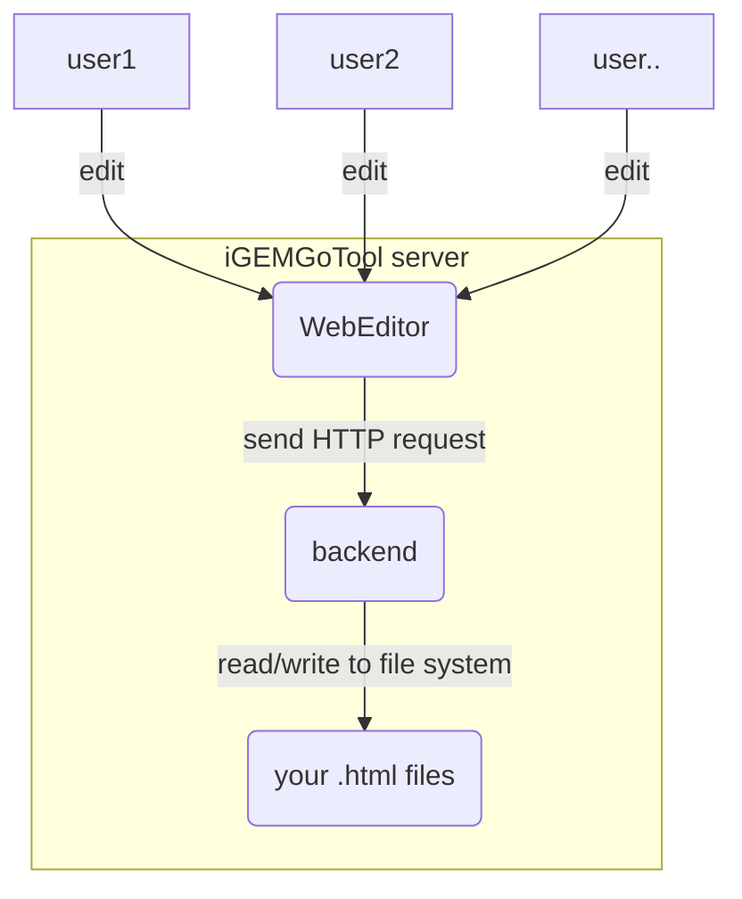

# iGEMGoTool 🛠️

[](mailto:950288s@gmail.com)

iGEMGoTool is a Online Web Editor that helps iGEM teams easily edit their wikis. It consists of a front-end implemented in Vue 3 and a back-end implemented in Go.

## Introduction for Users 🧑‍💼

iGEMGoTool is a user-friendly Online Web Editor that allows iGEM teams to easily edit their wikis. It provides a simple interface for making changes to pages. With iGEMGoTool, wiki editors can focus on creating great content for their wikis without worrying about the technical details of HTML and CSS.

To use iGEMGoTool, follow these steps:

1. put the Unziped `iGEMGoTool` folder into the root directory of your project.
2. Insert the following special tag into your `.html` or other custom file type for each section that you want to edit: `<!-- iGEMGoTool {{name}} start-->`. Replace `{{name}}` with the The custom name for this section.
``` Example
<!-- iGEMGotool test1 start-->
```

3. Double-click the iGEMGoTool executable to run the tool. Then you can see to generated URL in the Console like below. You can edit you page in the browser through the generated URL, and iGEMGoTool also supports collaborative editing function in the local area network. 
```
   Server started on port 8080
    Local:           http://127.0.0.1:8080/
    Network:         http://192.168.Xx.xx:8080/
```
    
1. For advanced usage, you can deploy iGEMGoTool to a personal server and open ports for the service. which will break the LAN restrictions.

we also provide configuration file, `config.json`, which will be automatically generated upon the first run of the application. It allows the user to customize certain parameters such as the directory containing the pages to be modified, the directory to store the edited pages, the port to be used, the tag to be scanned for insertion, and the file types to be scanned. The default values for these parameters can be seen in the example configuration file below:
```
{
	// Directory containing the page to be modified (e.g. "D:\\github\\web\\src\\pages")
	"ScanDirectory": "..\\",

	// Directory to store the edited page (e.g. "D:\\github\\web\\src\\iGEMGotoolData")
	"StoreDirectory": "..\\iGEMGotoolData",

	//Port to be used
	"Port": 8080,

	//the tag to be scan and incert content (e.g. "iGEMGotool"),
	//which be automatically converted to <!-- iGEMGotool {{name}} start-->
	"incert tag":"iGEMGotool",

	
	//file type to be scan (e.g. [".html",....])
	"file type":[".html",".vue"]
}
```

Note: A page can contain multiple tags and each tag corresponds to a section that can be edited individually.

## Introduction for Developers 🧑‍💻

The following is intended for developers who want to improve the tool or compile it by themselves, but if you just want to use the tool, it is not necessary to read further！

iGEMGoTool is developed using a modern stack that includes Vue 3 and Go. The front-end is implemented using Vue 3 and is built using the Vite build tool. The back-end is implemented using Go and provides a RESTful API for the front-end to interact with.

To set up the development environment for iGEMGoTool, you will need to have [Node.js](https://nodejs.org/) and [Go](https://golang.org/) installed on your system. Then, follow these steps:

1. Clone this repository and navigate to the root directory.
2. Run `npm install` to install the required dependencies for the front-end.

To start the development for the front-end, run `npm run dev`. 
To build the front-end for production, run `npm run build-web`.

All cose for back-end is under the `GoTool` directory. 
To start the development for the back-end, run `go run GoTool/serve.go`. 
To build the back-end, run `npm run build-go`. 

To build both the front-end and back-end for production, run `npm run build-all`.
The target program generated by the compilation is under the dist folder

## Working Principle 📝

The working principle of iGEMGoTool can be summarized in the following diagram:



The front-end sends HTTP requests to the back-end to retrieve and update page content. The back-end reads and writes to the file system to access and modify the pages on disk.

## Technology Stack 🛠️

- Front-end: Vue 3, TypeScript, Vite, tiptap
- Back-end: Go 
- Build tool: Vite, go build
