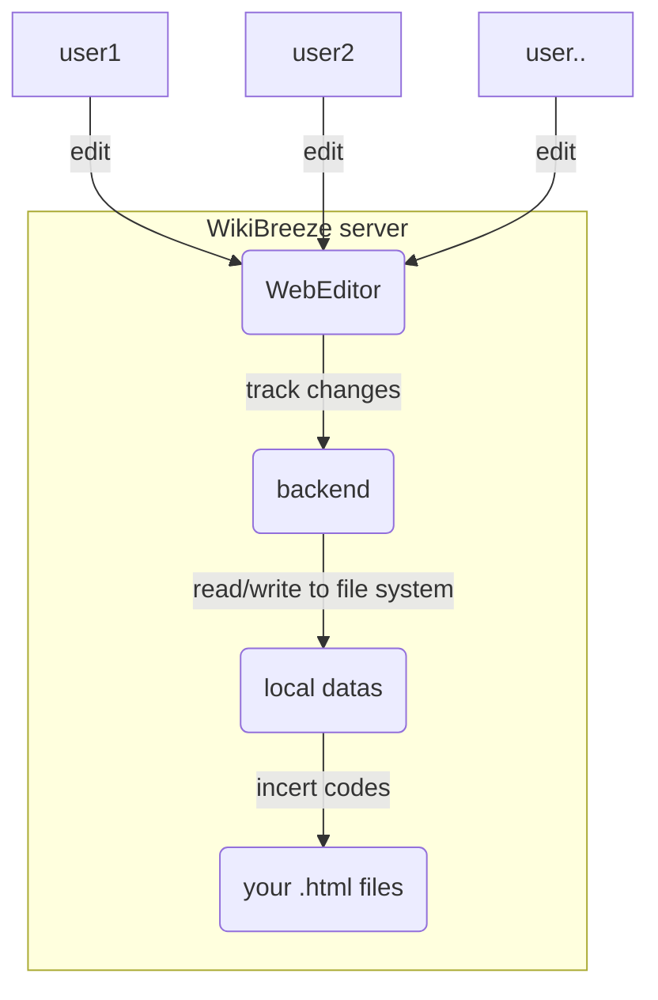

# WikiBreeze （[简体中文](https://github.com/950288/WikiBreeze/blob/main/README_zh.md)）🛠️

[](mailto:950288s@gmail.com)

WikiBreeze is an online collaborative wiki content editor that enables complete separation of wiki code writing🧑‍💻 and content filling ✍️ with high adaptability and extremely concise operability 🦾, which can greatly improve wiki development efficiency 🥰.

## Introduction for Users (developing)🧑‍💼

WikiBreeze is a user-friendly online editor 🧰 that allows iGEM teams to easily edit wikis. it provides a simple interface for editing wiki content pages. And only one person from the whole team needs to install it to enable collaborative editing for the whole team. With WikiBreeze, wiki content editors can focus on quality content without having to think about the technical details of HTML and CSS.

To use WikiBreeze, follow these steps:

1. Download the latest version of the `WikiBreeze` zip archive, put the Unziped `WikiBreeze` folder into the root directory of your project.
2. Insert the following special tag into your `.html` file or other custom file type for each section that you want to edit: `<!-- WikiBreeze content start-->`. Replace 'content' with the The custom name for this section.(Note: A page can contain multiple tags corresponds to a section that can be edited individually.)
```
<!-- WikiBreeze test1 start-->
```

1. Execute WikiBreeze.exe in the console to run the tool. Then you can see generated URL like below. You can edit you page in the browser through the generated URL, WikiBreeze also supports collaborative editing within a LAN (e.g. personal hotspot, campus network, etc.), so team members within the same LAN can access the editing page via the second link.
```
Server started on port 8080
    Local:           http://127.0.0.1:8080/
    Network:         http://192.168.Xx.xx:8080/
```
    
1. For advanced usage, you can deploy WikiBreeze to a personal server and open ports for the service without worrying about LAN restrictions

we also provide configuration file, `config/config.json`, which will be automatically generated upon the first run of the application. It allows to customize certain parameters such as the directory containing the pages to be modified, the directory to store the edited pages data, the port to be used, the tag to be scanned for insertion, and the file types to be scanned. The default values for these parameters can be seen in the example configuration file below:
```
{
	// Directory containing the page to be modified (e.g "D:\\github\\web\\src\\pages")
	"scanDirectory": "..\\",

	// Directory to store the edited page (e.g. "D:\\github\\web\\src\\WikiData")
	"storeDirectory": ".\\WikiData",

	// Port to be used (e.g. "8080" or "auto")
	"port": "auto",

	// File type to be scan (e.g. [".html",....])
	"fileType":[".html",".vue"]
}
```


## Project Building Guide 🧑‍💻

The following is for developers wishing to make improvements to the tool, but if you just want to do basic usage, no further reading is required!

WikiBreeze is developed using a modern stack that includes Vue 3 and Go. The front-end is implemented using Vue 3 and Typescript, and it is built using the Vite build tool. The back-end is implemented using Go and provides a RESTful API for the front-end to interact with.

To set up the development environment for WikiBreeze, you will need to have [Node.js](https://nodejs.org/) and [Go](https://golang.org/) installed on your system. Then, follow these steps to build the project:
1. Clone this repository and navigate to the root directory.
2. Run `npm install` to install the required dependencies for the front-end.
3. To build both the front-end and back-end for production, run `npm run build`.
4. The target program generated by the compilation is under the dist folder
   
To develop this project, you can run the following commands:
1. run `cd FrontEnd && npm run dev` to start the front-end development server.
2. run `cd BackEnd && go run .` to start the back-end development server.
3. access the link in the frontEnd console to view the page.

## Working Principle 📝

The working principle of WikiBreeze can be summarized in the following diagram:



The front-end WebEditor sends HTTP requests to the back-end to retrieve and update the edited content. The backend reads and writes automatically generated data files in real time and synchronizes the changes to the wiki code.

## Technology Stack 🛠️

- Front-end: Vue 3, TypeScript, Vite, tiptap
- Back-end: Go 
- Build tool: Vite, go build

## To-Do List 🤫
-  ...
-  ✔️ set link 🙂
-  v1.0.0
-  ✔️ citation 🐰
-  ✔️ table with note 🦉
-  ✔️ img with note 🌌
-  ✔️ custom extensions 🗽
-  v1.1.0
-  page tempalte with css
-  v1.1.0
-  access code with cookie
-  auto git commit
-  v2.0.0
-  custom account login
-  v3.0.0
-  ......