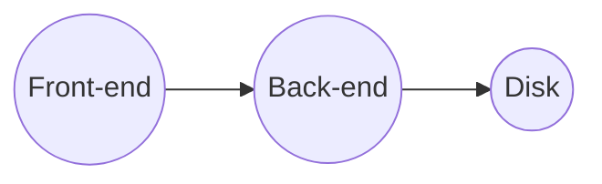

# iGEMGoTool 🛠️

iGEMGoTool is a tool that helps iGEM teams easily edit their wikis. It consists of a front-end implemented in Vue 3 and a back-end implemented in Go.

## Introduction for Users 🧑‍💼

iGEMGoTool is a user-friendly tool that allows iGEM teams to easily edit their wikis. It provides a simple interface for making changes to pages and previewing the results in real-time. With iGEMGoTool, teams can focus on creating great content for their wikis without worrying about the technical details of HTML and CSS.

To use iGEMGoTool, follow these steps:

1. Unzip the iGEMGoTool folder and put it into the root directory of your project.
2. Insert the following special tag into your HTML or other custom file type for each section that you want to edit: `<!-- iGEMGoTool {{name}} start-->`. Replace `{{name}}` with the name of your page.
3. Double-click the iGEMGoTool executable to run the tool. You can also edit web pages in the browser through the generated URL, and iGEMGoTool also supports collaborative editing function in the local area network. For advanced usage, you can deploy iGEMGoTool to a personal server and open ports to break the LAN restrictions.

Note: A page can contain multiple tags and each tag corresponds to a section that can be edited individually.

## Introduction for Developers 🧑‍💻

iGEMGoTool is developed using a modern stack that includes Vue 3 and Go. The front-end is implemented using Vue 3 and is built using the Vite build tool. The back-end is implemented using Go and provides a RESTful API for the front-end to interact with.

To set up the development environment for iGEMGoTool, you will need to have [Node.js](https://nodejs.org/) and [Go](https://golang.org/) installed on your system. Then, follow these steps:

1. Clone this repository and navigate to the root directory.
2. Run `npm install` to install the required dependencies for the front-end.

To start the development server for the front-end, run `npm run dev`. To build the front-end for production, run `npm run build-web`.

To build the back-end, run `npm run build-go`. To build both the front-end and back-end for production, run `npm run build-all`.

## Working Principle 📝

The working principle of iGEMGoTool can be summarized in the following diagram:

The front-end sends HTTP requests to the back-end to retrieve and update page content. The back-end reads and writes to the file system to access and modify the pages on disk.

## Technology Stack 🛠️

- Front-end: Vue 3, TypeScript, Vite
- Back-end: Go
- Text editor: tiptap
