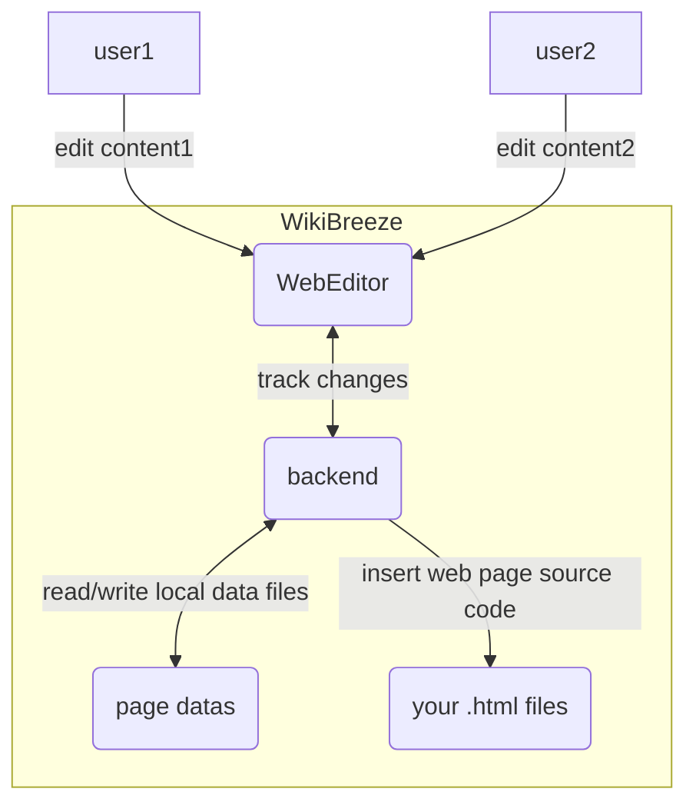

# WikiBreeze ([简体中文](https://github.com/950288/WikiBreeze/blob/main/README_zh.md)) 🛠️

[](mailto:950288s@gmail.com)

WikiBreeze is a collaborative LAN wiki content editor that enables complete separation of wiki code writing🧑‍💻 and content filling ✍️ with concise operability 🦾, which can greatly improve wiki development efficiency 🥰.

## Introduction🧑‍💼

WikiBreeze is a user-friendly LAN editor 🧰 that allows iGEM team members to easily edit wikis. it provides a simple interface for editing wiki content pages. And only one person from the whole team needs to install it to enable collaborative editing for the whole team. With WikiBreeze, wiki content editors can focus on quality content without having to think about the technical details of HTML and CSS.

To use WikiBreeze, follow these steps:

1. Download the latest [release](https://github.com/950288/WikiBreeze/releases) of the `WikiBreeze` zip archive and unzip it. Put the `WikiBreeze` folder into the root directory of your wiki project.  
````bash
    project name
    ├── Wikibreeze
    │   ├── WikibreezeData
    │   ├── WikiBreeze.exe
    │   └── ...
    ├── home.html
    ├── xxx.html
    ├── pages
    │   ├── xxx.html
    │   └── ...
    └── ...
````

2. Insert the following special tag into each `.html` file or other file type where you want to edit: `<!-- WikiBreeze {{CONTENT}} start-->`. Replace `{{CONTENT}}` with an arbitrary custom name. (Note: A page can contain multiple differently named tags, and each part corresponding to a tag can be edited independently.) If no file containing this tag is found in the project directory, a sample file `testPage.html` will be generated automatically.
```html
<div> 
    <!-- WikiBreeze test1 start-->
</div>
```

3. Use terminals run the executable file WikiBreeze.exe in the WikiBreeze directory to start the tool. You will then see the generated URL in the console, as shown below. You can edit your wiki in the browser via the generated URL. WikiBreeze also supports collaborative editing within a LAN (e.g. personal hotspot, campus network, etc.), so team members within the same LAN can access the editing page through the second link.
```
   Server started on port 5001
    Local:           <http://127.0.0.1:5001/> 
    Network:         <http://192.168.Xx.xx:5001/>
```  

4. The HTML source code after editing and saving will be automatically inserted into the relative position of the page. At the same time, the WikibreezeData folder will be generated to store the information of the edited page.

5. Add `Wikibreeze/` directory into .gitignore file.  

6. We also provide a configuration file WikibreezeData/config/config.json, which will be automatically generated upon the first run of the application. It allows you to customize certain parameters such as the directory containing the pages to be modified, the port to be used, and the file types. The default values for these parameters can be seen in the example configuration file below:
```
{
    // Directory containing the page to be modified (e.g. "D:/github/web/src/pages/")
    "scanDirectory": "../",  

    // Port to be used (e.g. "5001" or "auto")
    "port": "auto",  

    // File type to be scanned (e.g. [".html",....])
    "fileType":[".html",".vue"]
}
```

7. see [Features](https://github.com/950288/WikiBreeze/wiki/Wikibreeze-Editor-Features) for more details.


## Project Building Guide 🧑‍💻 
The following is for developers wishing to make improvements to the tool or build it by your self! 
WikiBreeze is developed using Vue 3 and Go. The front-end is implemented using Vue 3 and TypeScript and built using the Vite build tool. The back-end is implemented using Go and provides a RESTful API for the front-end to interact with.
To set up the development environment for WikiBreeze, you need to have [Node.js](https://nodejs.org/) and [Go](https://golang.org/) installed on your system. Then, follow these steps:
1. Clone this repository and navigate to the root directory. 
2. Run `npm install` to install the required dependencies for the front-end.
 
To build the front-end, run `npm run build:frontend`. 
To build the back-end, run `npm run build:backend`. 

To build both front-end and back-end, run `npm run build`. 
The target program generated by the compilation is under the `Wikibreeze` folder.

To develop this project simultaneously in Vue 3 and Go, you need to run the following commands in two different terminals:
`cd frontend && npm run dev`
`cd backend && go run` .
This will start the front-end development server and the back-end development server. You can access the link in the front-end console to view the page.

## Working Principle 📝

The working principle of WikiBreeze can be summarized in the following diagram:



The front-end WebEditor sends HTTP requests to the back-end to retrieve and update the edited content. The back-end reads and writes automatically generated data files in real time and synchronizes the changes to the wiki code.

## Technologies 🛠️

- FrontEnd: Vue 3, TypeScript, Vite, tiptap
- BackEnd: Go 
- Build tool: Vite, go build

## To-Do List 🤫
-  ...
-  ✔️ table with note 🦉
-  ✔️ img with note 🌌
-  v1.0.0
-  ✔️ custom tag names 🗽
-  ✔️ citation 🐰
-  v1.1.0
-  accessCode
-  auto git commit
-  custom account login
-  ......
