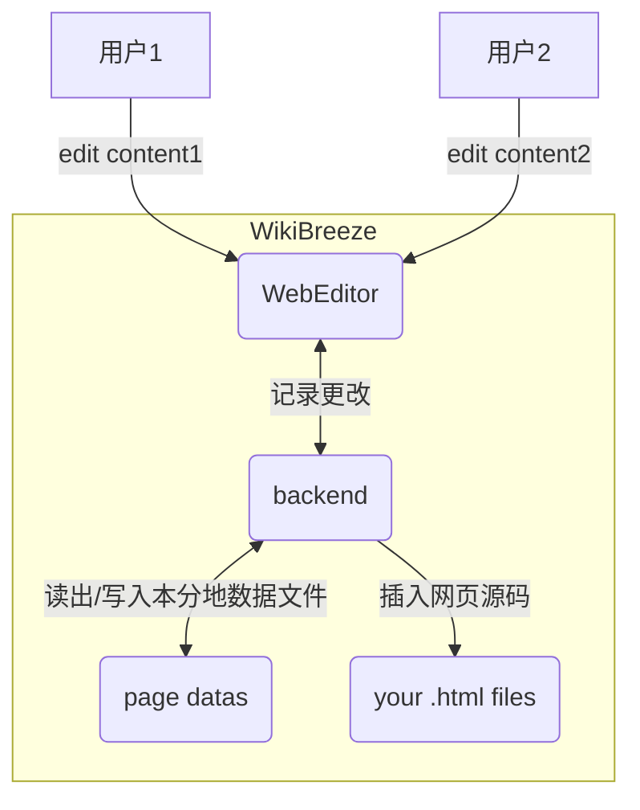

# WikiBreeze （[English](https://github.com/950288/WikiBreeze/blob/main/README.md))🛠️

[](mailto:2779307196@qq.com) 

WikiBreeze 是一款在线协同wiki内容编辑器，能够实现wiki代码编写🧑‍💻与内容填充✍️的完全分离，具有极高的适配性和极简操作性🦾，能够极大提高wiki开发效率🥰。

## 使用说明🧑‍💼

WikiBreeze 是一个用户友好的在线编辑器🧰，允许 iGEM 团队轻松编辑wiki。它提供了一个简单的界面，用于编辑wiki内容页面。并且全团队只需要一人安装，即可实现整个团队的协同编辑。使用 WikiBreeze，wiki内容编辑者可以专注于优质内容，而无需考虑 HTML 和 CSS 的技术细节。

使用 WikiBreeze，请按照以下步骤操作：

1. 下载最新版的`WikiBreeze`压缩包([release](https://github.com/950288/WikiBreeze/releases))，将解压的 `WikiBreeze` 文件夹放入你的wiki项目目录中。
````bash
    project name
    ├── Wikibreeze
    │   ├── WikibreezeData
    │   ├── WikiBreeze.exe
    │   └── ...
    ├── home.html
    ├── xxx.html
    ├── pages
    │   ├── xxx.html
    │   └── ...
    └── ...
````

2. 在您想要编辑的每`.html`文件或其他文件类型中插入以下特殊标记: `<!-- WikiBreeze {{CONTENT}} start-->`。将 `{{CONTENT}}` 替换为一个任意的自定义名称。(注意: 一个页面可以包含多个不同名标记，每个标记所对应的部分可被独立编辑。)如果没有在项目目录中找到含有该标记的文件，将自动生成实例文件`testPage.html`。
```html
<div>
    <!-- WikiBreeze test1 start-->
</div>
```

3. 在终端运行WikiBreeze目录中的WikiBreeze可执行文件启动该工具。然后你将在控制台中看到生成的 URL，如下所示。您可以通过生成的URL在浏览器中进行wiki编辑，WikiBreeze 还支持局域网(如个人热点、校园网等)内的协作编辑功能，同一局域网内的团队成员可通过第二链接访问编辑页面。
```
   Server started on port 8080
    Local:           http://127.0.0.1:8080/
    Network:         http://192.168.Xx.xx:8080/
```

4. 编辑保存后的html源码会被自动插入到页面相对位置，同时会生成WikibreezeData文件夹储存所编辑页面的信息。
   
5. Add `Wikibreeze/` directory into .gitignore file.  

6. 我们还提供了配置文件 WikibreezeData/config/config.json，该文件在应用程序首次运行时会自动生成。它允许用户自定义某些参数，如要修改的页面的目录使、使用的端口、文件类型。下面的示例配置文件显示了这些参数的默认值：
```
{
	// 包含要修改的页面的目录 (e.g. "D:/github/web/src/pages/")
	"ScanDirectory": "../",

	//使用的端口 (e.g. "8080" or "auto")
	"Port": "auto",
	
	//要扫描的文件类型 (e.g. [".html",....])
	"file type":[".html",".vue"]
}
```

## 构建指南 🧑‍💻

以下内容适用于希望对该工具进行改进开发人员或想要自行打包者！

WikiBreeze 使用Vue3 和 Golang 开发。前端使用 Vue 3 和 Typescript 实现，并使用 Vite 构建工具构建。后端使用 Go 实现，能够进行文件读取并与前端交互。

要为 WikiBreeze 设置开发环境，您需要在系统上安装 [Node.js](https://nodejs.org/) 和 [Go](https://golang.org/)。然后，按照以下步骤操作：

1. 克隆此仓库并进入根目录。
2. 运行 `npm install` 以安装前端所需的依赖项。

要进行前端构建，运行 `build:frontend`。
要进行后端构建，运行 `build:backend`。
同时构建前端和后端，运行 `npm run build`。
编译生成的目标程序位于 `Wikibreeze` 文件夹中。

要同时进行 Vue 3 和 Go 的开发，您需要在两个不同的终端中运行以下命令：
`cd frontend && npm run dev`
`cd backend && go run .`。

This will start the front-end development server and the back-end development server. You can access the link in the front-end console to view the page.

## 工作原理 📝

WikiBreeze 的工作原理可以在以下图中总结：:



前端 WebEditor 向后端发送 HTTP 请求以检索和更新编辑的内容。后端实时读写自动生成的数据文件，并将更改同步到wiki代码中去。

## Technology 🛠️

- FrontEnd: Vue 3, TypeScript, Vite
- BackEnd: Go 
- Build tool: Vite, go build
