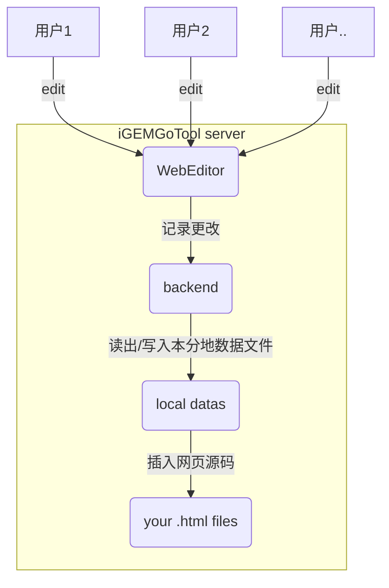

# iGEMGoTool （[English](https://github.com/950288/iGEMGoTool/blob/main/README.md)\）本文件上次更新 2023-1-2 21:19:56🛠️

[](mailto:2779307196@qq.com)

iGEMGoTool 是一个在线编辑器，可以帮助 iGEM 团队轻松编辑wiki。它由 Vue 3 实现的前端和 Go 实现的后端组成。

## 使用说明  🧑‍💼

iGEMGoTool 是一个用户友好的在线编辑器，允许 iGEM 团队轻松编辑wiki。它提供了一个简单的界面，用于修改页面。使用 iGEMGoTool，wiki编辑器可以专注于为wiki创建优质内容，而无需担心 HTML 和 CSS 的技术细节。

使用 iGEMGoTool，请按照以下步骤操作：

1. 将解压的 `iGEMGoTool` 文件夹放入项目根目录中。
2. 在您想要编辑的每个部分的 `.html` 或其他自定义文件类型中插入以下特殊标记： `<!-- iGEMGoTool {{name}} start-->`。将 `{{name}}` 替换为此部分的自定义名称。
``` Example
<!-- iGEMGotool test1 start-->
```

3. 双击 iGEMGoTool 可执行文件运行工具。然后你可以在控制台中看到生成的 URL，如下所示。您可以通过生成的 URL 在浏览器中编辑页面，iGEMGoTool 还支持局域网内的协作编辑功能。
```
   Server started on port 8080
    Local:           http://127.0.0.1:8080/
    Network:         http://192.168.Xx.xx:8080/
```
    
4. 对于高级用法，您可以将 iGEMGoTool 部署到个人服务器并打开服务的端口，这将打破 LAN 限制。

我们还提供了配置文件 config.json，该文件在应用程序首次运行时会自动生成。它允许用户自定义某些参数，如包含要修改的页面的目录、用于存储编辑的页面的目录、要使用的端口、要扫描的插入标记以及要扫描的文件类型。下面的示例配置文件显示了这些参数的默认值：
```
{
	// 包含要修改的页面的目录 (e.g. "D:\\github\\web\\src\\pages")
	"ScanDirectory": "..\\",

	// 用于存储被编辑的页面数据的目录 (e.g. "D:\\github\\web\\src\\iGEMGotoolData")
	"StoreDirectory": "..\\iGEMGotoolData",

	//使用的端口
	"Port": 8080,

	//要扫描的插入标记 (e.g. "iGEMGotool"),
	//将自动转换为 <!-- iGEMGotool {{name}} start-->
	"incert tag":"iGEMGotool",

	
	//要扫描的文件类型 (e.g. [".html",....])
	"file type":[".html",".vue"]
}
```

Note: 一个页面可以包含多个标记，每个标记对应可单独编辑的一个部分。

## 开发人员指南 🧑‍💻

以下内容适用于希望改进工具或自己编译工具的开发人员，但如果您只是想使用工具，则不需要进一步阅读！

iGEMGoTool 使用包括 Vue 3 和 Go 的现代技术栈开发。前端使用 Vue 3 实现，并使用 Vite 构建工具构建。后端使用 Go 实现，为前端提供 RESTful API 以进行交互。

要为 iGEMGoTool 设置开发环境，您需要在系统上安装 [Node.js](https://nodejs.org/) 和 [Go](https://golang.org/)。然后，按照以下步骤操作：

1. 克隆此存储库并导航到根目录。
2. 运行 `npm install` 以安装前端所需的依赖项。

要开始前端的开发，运行 `npm run dev`。
要为生产环境构建前端，运行 `npm run build-web`。

所有后端代码都位于 `GoTool` 目录下。
要开始后端的开发，运行 go run GoTool/serve.go。
要构建后端，运行 npm run build-go。

为生产环境构建前端和后端，运行 npm run build-all。
编译生成的目标程序位于 dist 文件夹中。


## 工作原理 📝

iGEMGoTool 的工作原理可以在以下图中总结：:



前端 WebEditor 向后端发送 HTTP 请求以检索和更新页面内容。后端读写文件系统以访问和修改磁盘上的页面。

## 技术栈 🛠️

- 前端: Vue 3, TypeScript, Vite, tiptap
- 后端: Go 
- 构建工具: Vite, go build
