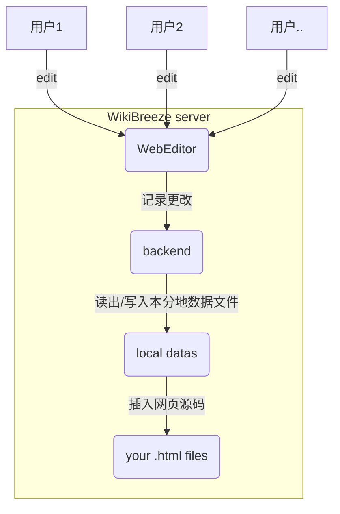

# WikiBreeze （[English](https://github.com/950288/WikiBreeze/blob/main/README.md)🛠️

[](mailto:2779307196@qq.com)

# 该项目正在开发中，待第一个版本还未发布，待第一个版本发布后，将提供详细的使用说明。

# 以下内容还未跟新

WikiBreeze 是一款在线协同wiki内容编辑器，能够实现wiki代码编写🧑‍💻与内容填充✍️的完全分离，具有极高的适配性和极简操作性🦾，能够极大提高wiki开发效率🥰。

## 使用说明 (开发ing) 🧑‍💼

WikiBreeze 是一个用户友好的在线编辑器🧰，允许 iGEM 团队轻松编辑wiki。它提供了一个简单的界面，用于编辑wiki内容页面。并且全团队只需要一人安装，即可实现整个团队的协同编辑。使用 WikiBreeze，wiki内容编辑者可以专注于优质内容，而无需考虑 HTML 和 CSS 的技术细节。

使用 WikiBreeze，请按照以下步骤操作：

1. 下载最新版的`WikiBreeze`压缩包，将解压的 `WikiBreeze` 文件夹放入你的wiki项目根目录中。
2. 在您想要编辑的每 `.html` 文件或其他自定义文件类型中插入以下特殊标记： `<!-- WikiBreeze {{name}} start-->`。将 `{{name}}` 替换为一个任意的自定义名称。(注意: 一个页面可以包含多个标记，每个标记所对应的部分可被单独编辑。)
```
<div>
    <!-- WikiBreeze test1 start-->
</div>
```


3. 双击 WikiBreeze 可执行文件运行工具。然后你可以在控制台中看到生成的 URL，如下所示。您可以通过生成的 URL 在浏览器中进行wiki编辑，WikiBreeze 还支持局域网(如个人热点、校园网等)内的协作编辑功能，同一局域网内的团队成员可通过第二链接访问编辑页面。
```
   Server started on port 8080
    Local:           http://127.0.0.1:8080/
    Network:         http://192.168.Xx.xx:8080/
```
    
4. 对于进阶用法，您可以将 WikiBreeze 部署到个人服务器并开启相应服务端口，这将破除局域网的局限。

我们还提供了配置文件 config.json，该文件在应用程序首次运行时会自动生成。它允许用户自定义某些参数，如包含要修改的页面的目录、用于存储编辑的页面的目录、要使用的端口、要扫描的插入标记以及要扫描的文件类型。下面的示例配置文件显示了这些参数的默认值：
```
{
	// 包含要修改的页面的目录 (e.g. "D:\\github\\web\\src\\pages")
	"ScanDirectory": "..\\",

	// 用于存储被编辑的页面数据的目录 (e.g. "D:\\github\\web\\src\\WikiBreezeData")
	"StoreDirectory": "..\\WikiBreezeData",

	//使用的端口
	"Port": 8080,

	//要扫描的插入标记 (e.g. "WikiBreeze"),
	//将自动转换为 <!-- WikiBreeze {{name}} start-->
	"incert tag":"WikiBreeze",

	
	//要扫描的文件类型 (e.g. [".html",....])
	"file type":[".html",".vue"]
}
```

<!-- Note: ww -->

## 构建指南 🧑‍💻

以下内容适用于希望对该工具进行改进开发人员，但如果您只是想进行基本的使用，则不需要进一步阅读！

WikiBreeze 使用包括 Vue 3 和 Go 的技术栈开发。前端使用 Vue 3 和 Typescript 实现，并使用 Vite 构建工具构建。后端使用 Go 实现，为前端提供 RESTful API 以进行交互。

要为 WikiBreeze 设置开发环境，您需要在系统上安装 [Node.js](https://nodejs.org/) 和 [Go](https://golang.org/)。然后，按照以下步骤操作：

1. 克隆此仓库并进入根目录。
2. 运行 `npm install` 以安装前端所需的依赖项。

要进行前端的开发，运行 `npm run dev`。
要进行前端构建，运行 `npm run build-web`。

所有后端代码都位于 `GoTool` 目录下。
要进行后端的开发，运行启动服务 `go run GoTool/serve.go`。
要进行后端构建，运行 `npm run build-go`。

同时构建前端和后端，运行 `npm run build-all`。
编译生成的目标程序位于 `dist` 文件夹中。


## 工作原理 📝

WikiBreeze 的工作原理可以在以下图中总结：:



前端 WebEditor 向后端发送 HTTP 请求以检索和更新编辑的内容。后端实时读写自动生成的数据文件，并将更改同步到wiki代码中去。

## 技术栈 🛠️

- 前端: Vue 3, TypeScript, Vite, tiptap
- 后端: Go 
- 构建工具: Vite, go build
